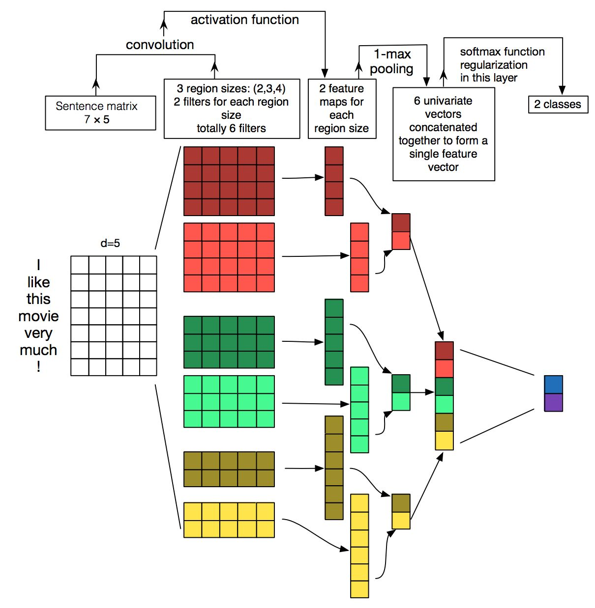

# TextCNN

| **A picture is worth a thousand words ！** |
| :----------------------------------------- |
|                            |

## Dataset

Sentences are subset of **THUCTC **(THU Chinese Text Classification),  http://thuctc.thunlp.org/, format as fastText.

## Train
python train.py -h

## Evaluate

`python eval.py -h`

## Predict

`python predict.py -h`

Your text must be **separated by space** and **longer than the max kernel size (Reference config.py)**.

## Requirement

* python 3.6
* pytorch 0.4.0
* torchtext 0.3.0 

* https://arxiv.org/abs/1408.5882)

## License

TextCNN is released under the [Apache 2.0 license]

## Chinese Document

**通用文本分类器.**
